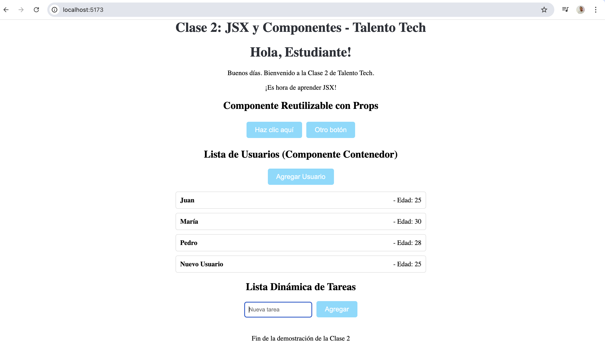

# Clase 2: JSX y Componentes

## Descripción de la Clase
En esta clase exploraremos el uso de JSX (JavaScript XML) en React y cómo construir componentes más avanzados. Aprenderemos a crear estructuras dinámicas, pasar datos entre componentes mediante props, y organizar nuestro código de manera escalable.

## Objetivos de la Clase
- Comprender la importancia y las ventajas del uso de JSX.
- Construir componentes más complejos que utilicen estructuras dinámicas.
- Aprender a utilizar props para pasar datos entre componentes.
- Practicar la reutilización y personalización de componentes.

## Objetivos Específicos
- Reforzar el uso y las ventajas de JSX.
- Repasar los conceptos de JavaScript importantes para el curso.
- Entender a fondo cómo pasar datos con props y sus diferentes técnicas.
- Organizar nuestros componentes de forma prolija y escalable.
- Diferenciar entre componentes de presentación y componentes contenedores.

## Contenido de la Clase
1. Introducción a JSX
2. Sintaxis y ventajas de JSX
3. Creación de componentes funcionales
4. Uso de props para pasar datos
5. Componentes dinámicos y condicionales
6. Organización de componentes
7. Componentes de presentación vs contenedores

## Cómo Ejecutar el Proyecto
1. Asegúrate de tener Node.js instalado.
2. Instala las dependencias: `npm install`
3. Ejecuta el servidor de desarrollo: `npm run dev`
4. Abre tu navegador en `http://localhost:5173/`

## Componentes Implementados
- **Greeting**: Demuestra JSX básico y props.
- **Button**: Componente reutilizable con props.
- **UserList**: Componente contenedor que maneja estado.
- **UserItem**: Componente de presentación.
- **DynamicList**: Estructuras dinámicas con listas y estado.

## Captura de Pantalla

En la captura se puede ver la aplicación React corriendo en el navegador, mostrando los diferentes componentes implementados para la Clase 2. Incluye un saludo personalizado que demuestra el uso de JSX y props, botones reutilizables, una lista de usuarios dinámica que maneja estado (componente contenedor), elementos de usuario simples (componentes de presentación), y una lista de tareas que permite agregar y eliminar items en tiempo real.

**Lo que se logró:**
- Implementación completa de una aplicación React funcional.
- Demostración práctica de JSX para mezclar HTML y JavaScript.
- Uso de props para pasar datos entre componentes padre e hijo.
- Creación de componentes reutilizables y personalizables.
- Estructuras dinámicas con listas, estado y eventos.
- Separación clara entre componentes de presentación (UI pura) y contenedores (lógica y estado).
- Organización escalable del código en archivos separados.

## Recursos Adicionales
- Documentación oficial de React sobre JSX
- Ejemplos de código en el repositorio de la clase
- Videos tutoriales de Talento Tech

