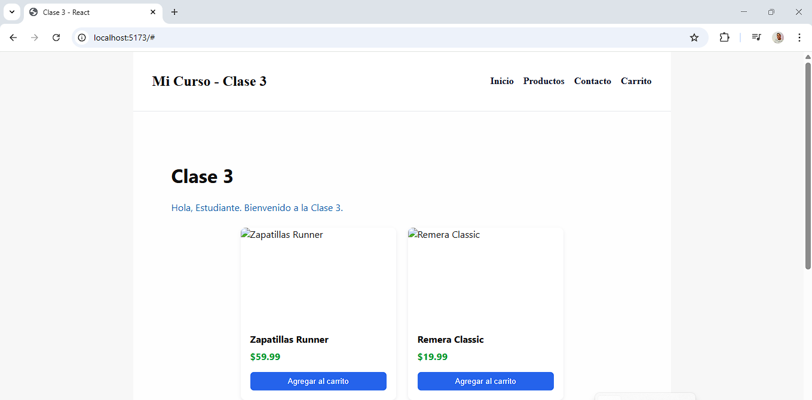

# Clase 3 — Resumen de la clase y guía rápida

Este documento contiene la información principal de la Clase 3: objetivos, estructura del proyecto, decisiones de diseño y ejercicios prácticos implementados en este repositorio.

## Objetivos de la Clase

- Aprender a estructurar un proyecto React desde cero usando Vite.
- Implementar un `Layout` reutilizable (Header + Footer + `children`).
- Practicar componentización por carpetas y uso de CSS Modules.
- Construir un pequeño catálogo con componentes reutilizables (`TarjetaProducto`) y una `Gallery` de ejemplo.

## Estructura creada (resumen)

- `index.html`, `src/main.jsx`: punto de entrada.
- `src/index.css`: estilos globales.
- `src/App.jsx`: ensamblaje principal que usa `Layout`.
- `src/layout/`: `Header.jsx`, `Footer.jsx`, `Layout.jsx`.
- `src/components/`: cada componente en su carpeta con `.jsx` y `.module.css` cuando aplica.

Componentes añadidos en este ejercicio:

- `Greeting` — mensaje de bienvenida.
- `Nav` — barra de navegación.
- `TarjetaProducto` — componente presentacional para productos.
- `Gallery` — grid que muestra varias `TarjetaProducto`.



## Estilos y buenas prácticas

- Estilos globales en `src/index.css` para tipografía, reset y fondo.
- CSS Modules (`*.module.css`) para estilos encapsulados por componente.
- Nombres en PascalCase y una carpeta por componente para facilitar mantenibilidad y pruebas.

## Cómo ejecutar

Desde la carpeta `Clase3`:

```powershell
npm install
npm run dev
```

Abrir en el navegador (recomendado Chrome): http://localhost:5173/

También hay una versión HTML estilizada del README pensada para verse bien en Chrome: `readme3.html` (abrir en el navegador).

## Ejercicios implementados

1. Layout con `Header` (incluye `Nav`) y `Footer`.
2. `TarjetaProducto` con CSS Module y botón "Agregar al carrito" (interfaz).
3. `Gallery` con 3 tarjetas de ejemplo y `placeholder` para imágenes.

## Recomendaciones (ingeniería de software)

1. Añadir tests unitarios con React Testing Library.
2. Mover datos de productos a `src/data/productos.json` y crear un hook `useProductos()`.
3. Evaluar `Context` o `Redux` para manejar estado global como carrito.
4. Añadir accesibilidad (atributos `alt`, roles, foco y tests de accesibilidad).

---

Si quieres, genero:

- `src/data/productos.json` + `useProductos()` y actualizo `Gallery` para consumirlo.
- Tests iniciales para `TarjetaProducto`.
- Mejoras visuales adicionales (paleta y diseño).
